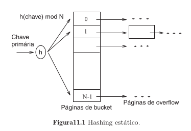

# Hashing Estático

|                                               |
|------------------------------------------------------------------------------------------------------------------------------------------|
| Fonte: Livro Sistemas de Gerenciamento de Banco de Dados, Terceira Edição, de Ramakrishnan e Gehrke, capítulo 11, seção 11.1, página 310 |

## Principais características

- Composto por uma coleção de $0$ até $N-1$ **buckets**, sendo **1 página primária** e seguido pelas **páginas de
  overflow**;
- O número de buckets é conhecido desde o momento que um arquivo de Hash Estático é criado, o que possibilita que
  páginas estáticas sejam armazenadas de forma sucessiva em disco.

## Operações

As operações em cima dessa organização são descritas abaixo.

### Inserção

Ocorre uma [pesquisa](./README.md#operações), após encontrar o local correto é inserido a entrada de dados. O caso
excepcional é **se não houver espaço no bucket**, nesse caso é **alocado uma nova página de overflow**, colocado a
entrada de dado na nova página e adicona a nova página a cadeia de overflow.

### Exclusão

Ocorre uma [pesquisa](./README.md#operações), após encontrar o local correto é removida a entrada de dados. O caso
excepcional é **se a entrada de dados encontrada for a última da página de overflow**, nesse caso a **página é removida
da cadeia de overflow** e **adicionada em uma lista de páginas livres**.

## Observações gerais

Dada a natureza de que cadeias de overflow tendem a crescer o desempenho das operações pode deteriorar com o tempo. A
busca por uma entrada de dados faz com que seja percorrida todas essas cadeias em busca de uma entrada. Mantendo
inicialmente 80% das paǵinas cheias podemos evitar páginas de overflow se o arquivo não crescer demais, contudo sendo a
única forma de se livrar de cadeias de overflow sendo a criação de novos arquivos com mais buckets.

Sendo o número de buckets fixos, se ocorrer de o **tamanho do arquivo diminuir muito**, teremos um problema de espaço
desperdiçado e se o **arquivo crescer muito** temos problemas de longas cadeias de overflow.

Como solução é possível executar um "hash" periodicamente sobre o arquivo para restaurar a situação ideal (sem cadeias
de overflow e ocupação em torno de 80%), contudo essa estratégia consome tempo e o índice se torna indisponível durante
a operação de "rehashing".