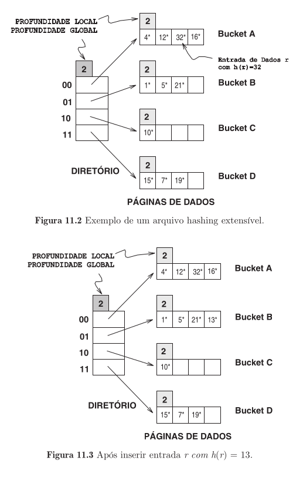
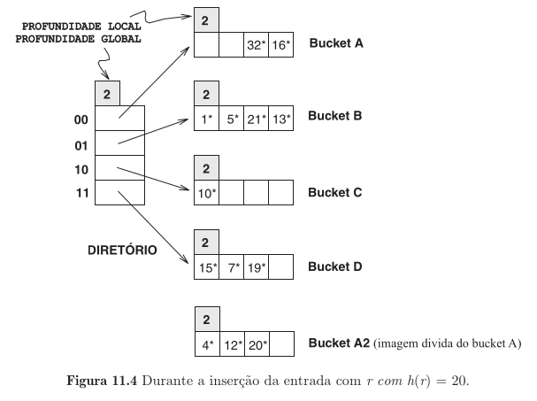
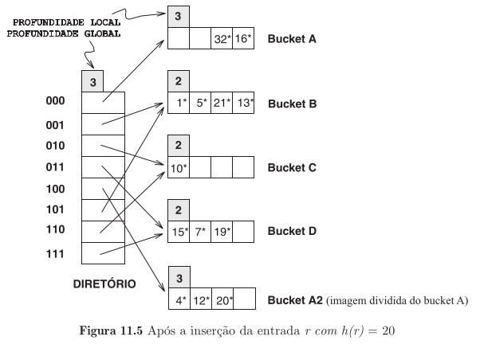
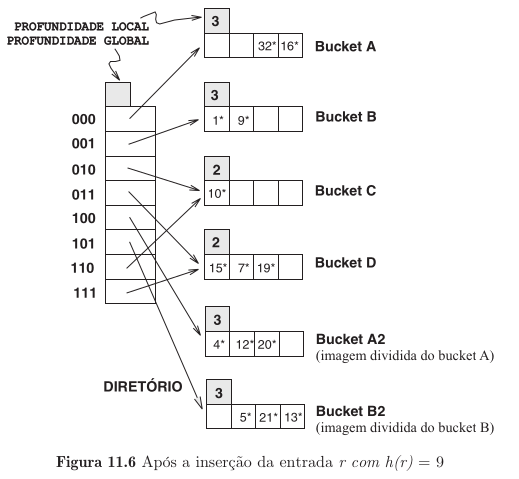

# Hashing Extensível

|                                           |
|------------------------------------------------------------------------------------------------------------------------------------------|
| Fonte: Livro Sistemas de Gerenciamento de Banco de Dados, Terceira Edição, de Ramakrishnan e Gehrke, capítulo 11, seção 11.2, página 311 |

## Principais Características

- Como solução ao problema de cadeias de overflow, ao invés de adicionar páginas fazemos a **reorganização do arquivo ao
  dobrar o número de buckets e redistribuindo as entradas pelo novo conjunto de buckets**.
- Para evitar o problema de o**arquivo inteiro ter de ser lido e duas vezes mais
  páginas terem de ser gravadas para se obter a reorganização** utilizamos um **diretório de ponteiros** para buckets,
  assim a duplicação ocorre ao duplicarmos o diretório e dividindo apenas o bucket que sofreu o overflow.

### O Diretório

Sendo feito através de uma matriz de órdem $N$, onde cada elemento é um ponteiro para um bucket.

## Operações

### Inserção

|  |
|--------------------------------------------------------------------------------------------------------------------------------------------------------|
| Fonte: Livro Sistemas de Gerenciamento de Banco de Dados, Terceira Edição, de Ramakrishnan e Gehrke, capítulo 11, seção 11.2, página 312               |

Ocorre uma [pesquisa](./README.md#operações), após encontrar o local correto é inserido a entrada de dados. O caso
excepcional é **se não houver espaço no bucket** fazemos:

1. **Divisão do bucket**: Alocamos um novo bucket (criação de uma única nova página);
2. **Redistribuição do conteúdo**: A redistribuição de entradas de dados (inclusive da nova) no bucket antigo e na "
   imagem dividida";
3. **Duplicação do diretório**: Consequência de uma divisão (e criação de novo bucket), se faz necessário diferenciar
   qual é qual no diretório, para isso fazemos a **duplicação de diretório**.

|  |
|--------------------------------------------------------------------------------------------------------------------------------------------------------------------------------------------------------------------|
| Fonte: Livro Sistemas de Gerenciamento de Banco de Dados, Terceira Edição, de Ramakrishnan e Gehrke, capítulo 11, seção 11.2, página 313                                                                           |

Não necessariamente uma divisão acarrete em uma duplicação, esse evento será necessário se o atributo de **profundidade
local** do bucket dividido for **igual** ao atributo de **profundidade global** do diretório.

A **profundidade global** será incrementada em 1 quando ocorrer a **duplicação do diretório**, enquanto que a **profundidade local** do bucket será acrescida em 1 quando ocorrer uma **divisão do bucket** (O novo bucket terá o
mesmo valor da profundidade local acrescida).

|  |
|-------------------------------------------------------------------------------------------------------------------------------------------------------------------------------------------------------------------------------|
| Fonte: Livro Sistemas de Gerenciamento de Banco de Dados, Terceira Edição, de Ramakrishnan e Gehrke, capítulo 11, seção 11.2, página 314                                                                                      |